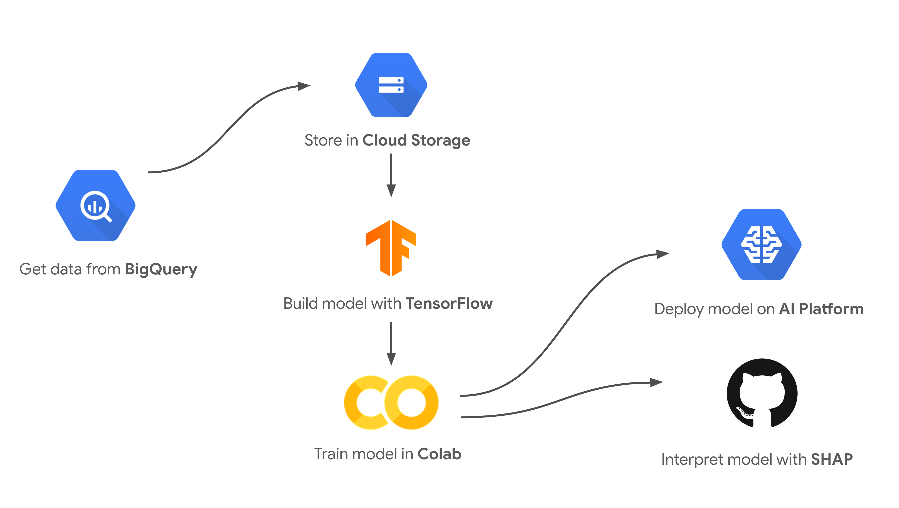

Text classification model interpretability demo
==========================

**This code is provided as example only. It is provided without guarantee or level of support.** This is not an official Google product (experimental or otherwise), it is just code that happens to be owned by Google.

This is the demo I presented at my [Cloud Next '19 talk](https://www.youtube.com/watch?v=OHIEZ-Scek8) with [Yufeng](https://twitter.com/yufengg). It shows how to build a bag of words text classification model to tag ML-related Stack Overflow questions, deploy the model to [AI Platform](https://cloud.google.com/ai-platform/), and interpret it's predictions with [SHAP](https://github.com/slundberg/shap).

## Running the notebook

To run the notebook, create a new [Colab notebook](http://colab.research.google.com) and import the `stackoverflow-classifier.ipynb` file in this repo. The CSV we used for the Stack Overflow training data is public. You'll need to create a Google Cloud project to deploy the model. If you don't want to do that, you'll still be able to run the SHAP code at the end of the notebook.

Got any feedback? File an issue or ping me on Twitter at [@SRobTweets](https://twitter.com/srobtweets)

**This is not an officially supported Google product.**